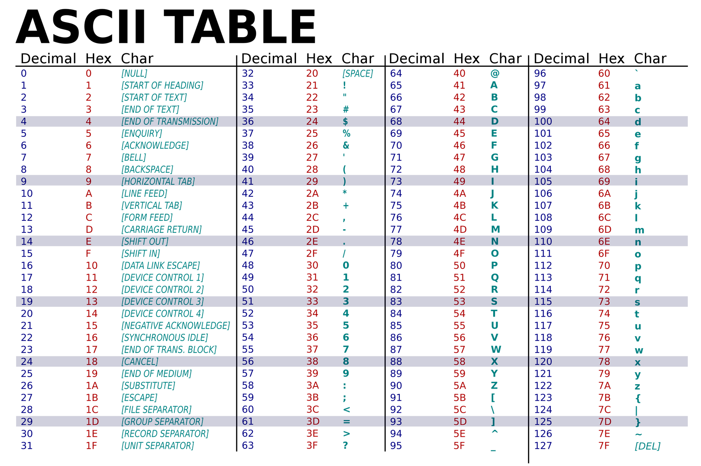
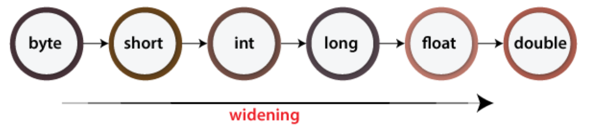

# Primitive Data Types

There are 8 primitive data types (note 1 byte = 8bits). Data with n bits can represent up to 2<sup>n</sup> different numbers.

- **byte**: 1-byte integer, range \[−2<sup>7</sup> , 2<sup>7</sup> − 1\]
- **short**: 2-byte integer, range \[−2<sup>15</sup> , 2<sup>15</sup> − 1\]
- **int**: 4-byte integer, range \[−2<sup>31</sup> , 2<sup>31</sup> − 1\]
- **long**: 8-byte integer, range \[−2<sup>63</sup> , 2<sup>63</sup> − 1\]
- **float**: single-precision floating-point number, around 6-7 significant digits, Range: ±10<sup>±37</sup>
- **double**: double-precision floating-point number, around 14-15 significant digits, Range: ±10<sup>±308</sup>
- **boolean**: a Boolean (it’s not spelled bool)
- **char**: 16-bit Unicode character, an extension of ASCII code

[ASCII vs. Unicode](https://www.spiceworks.com/tech/artificial-intelligence/articles/ascii-vs-unicode/)



### Exercise:

What is the output of the following snippet?

``` Java
public class AsciiTest {
    public static void main(String[] args) {
        char a = '0' + 2;
        System.out.println(a);
        char b = '0' + '2';
        System.out.println(b);
    }
}
```

Some **important points** about variables in Java:

- Unlike C++, you can **never** use an **uninitialized** variables
- If a variable is marked with `final` keyword, you can not change its value once you have assigned some value to it
- A fractional number literal, like `0.5`, is a **double literal.** If you want to make it float literal, add a `F` as its suffix, which means `0.5F`.

# Binary Representation

Due to hardware constraints, data in computers are composed of bits, aka binary representation. Binary representation is a base-2 number system that uses two states 0 and 1 to represent numbers.

## Binary representation to decimal

1.  Identify the binary number, which should consist only of 0s and 1s.
2.  Assign place values to each digit in the binary number, starting from the rightmost digit. The rightmost digit has a place value of 2^0 (which is 1), and each subsequent digit's place value doubles. For example, the second digit from the right has a place value of 2^1 (which is 2), the third digit has a place value of 2^2 (which is 4), and so on.
3.  Multiply and sum:
    Multiply each digit of the binary number by its corresponding place value, and then sum all the results. Start from the rightmost digit and move leftward.

For example, if you have the binary number 1101, you would perform the following calculations:

- 1 * 2^0 = 1
- 0 * 2^1 = 0
- 1 * 2^2 = 4
- 1 * 2^3 = 8

Finally, add the results: 1 + 0 + 4 + 8 = 13.

## Decimal representation to binary

1.  Divide by 2 and keep track of remainder and quotient
2.  Repeat Until the Quotient is 0
    - Continue dividing the quotient from the previous step by 2.
    - Record the remainders and the quotients until the quotient becomes 0.
3.  Read the remainders in **reverse** order, which gives you the binary representation of the decimal number.

Let's convert the decimal number 25 to binary:

- Start with 25.
- Divide 25 by 2: Quotient = 12, Remainder = 1.
- Divide 12 by 2: Quotient = 6, Remainder = 0.
- Divide 6 by 2: Quotient = 3, Remainder = 0.
- Divide 3 by 2: Quotient = 1, Remainder = 1.
- Divide 1 by 2: Quotient = 0, Remainder = 1.

Now, read the remainders in reverse order: 11001, which is the corresponding binary representation.

## Exercise

Translation between binary and decimal representation. Finish the following table:

|     |     |
| --- | --- |
| Binary representation | Decimal representation |
| 10101 |     |
| 10001101 |     |
|     | 35  |
|     | 47  |

**Question 1**: how do we represent negative numbers in binary representation?

[Binary Negative Numbers!](https://ryanstutorials.net/binary-tutorial/binary-negative-numbers.php)

**Question 2**: how do we represent floating point numbers in binary representation?

[Binary representation of the floating-point numbers](https://towardsdatascience.com/binary-representation-of-the-floating-point-numbers-77d7364723f1)

## Overflow & Underflow

In Java, overflow and underflow can occur when working with numerical data types, such as `int`, `long`, `float`, and `double`. Overflow occurs when a value exceeds the maximum representable value for its data type, while underflow occurs when a value falls below the minimum representable value for its data type.

For example, consider the following code:

``` Java
int a = 2147483647;    // max value for an int, 2^31
a = a + 1;             // a now overflows, becoming -2147483648 (the min value for an int)
```

In this example, the variable a is initialized with the maximum value represented by an int. When we attempt to increment it by 1, it overflows and becomes the minimum value for an int, which is negative.

Similarly, underflow can occur when subtracting from the minimum representable value of a data type. For example:

``` Java
int b = -2147483648;   // min value for an int, 2^31 - 1
b = b - 1;             // b now underflows, becoming 2147483647 (the max value for an int)
```

In this example, the variable b is initialized with the minimum value represented by an int. When we attempt to subtract 1 from it, it underflows and becomes the maximum value for an int.

Overflow and underflow can also occur when working with floating-point data types, such as float and double. In these cases, the overflow and underflow conditions are different and depend on the exponent of the floating-point number.

To prevent overflow and underflow, it's important to ensure that the values being used and calculated are within the range of their respective data types. In some cases, you may need to use a larger data type to accommodate larger values. You can also use error-checking techniques, such as range checking and boundary checking, to detect and prevent overflow and underflow conditions.

## Conversions

- explicit conversion/casting: usually done by putting data type in front of variables/values
    
    - e.g. `double d = ((double) 1) / ((double) 2);`
- implicit conversion/casting: this happens when doing arithmetic among mixed types.
    
    - e.g. `double d = 5;`, `'a' + 1`
    - the order of implicit conversion



In implicit conversion, widening conversion is automatic, but narrowing conversion is not (compilation errors). Though narrowing conversion is allowed in explicit conversion in terms of grammar, it may lead to unexpected behaviors due to underflow/overflow.

### Exercise:

What is the output of the following snippet?

```Java
public class FloatConversionTest {
    public static void main(String[] args)
    {
        double a = ((double) 1) / ((double) 2);
        System.out.println(a);
        double b = 1 / 2;
        System.out.println(b);
    }
}
```

What is the output of the following snippet?

```Java
public class ConversionTest {
    public static void main(String[] args)
    {
        System.out.println('a' + 13); // explicit or implicit conversion?
        System.out.println((char) ('a' + 13)); // explicit or implicit conversion?
    }
}
```

## Operations

- **Arithmetic operations** are used to perform basic mathematical calculations, e.g. `a + b`, `a - b`, `a * b`, `a / b`
- **Comparison operations** are used to compare two values and produce a boolean result, e.g. `x == y`, `x != y`, `x > y`
- **Logical operations** are used to combine and manipulate boolean values, e.g. `p && q`, `p || q`
- **Bitwise operations** are used to manipulate individual bits within integer types, e.g. `p & q`, `p | q`, `~p`
- **Assignment operations** are used to assign a value to a variable with/without arithmetic operators, e.g. `a += 5`, `a -= 1`
- **Increment and decrement operations** are used to increase or decrease the value of a variable by 1, e.g. `a++`, `++a`, `a--`

In Java, operators have different priorities, also known as precedence: [Java Operator Precedence
](https://www.programiz.com/java-programming/operator-precedence)

### Exercise

What is the output of the following snippet?

``` Java
public class AddTest {
    public static void main(String[] args)
    {
        int x = 10;
        
        System.out.println(x++);
        System.out.println(++x);
        System.out.println(x++ + ++x);
    }
}
```

[Interesting facts about Increment and Decrement operators in Java](https://www.geeksforgeeks.org/interesting-facts-increment-decrement-operators-java/)
